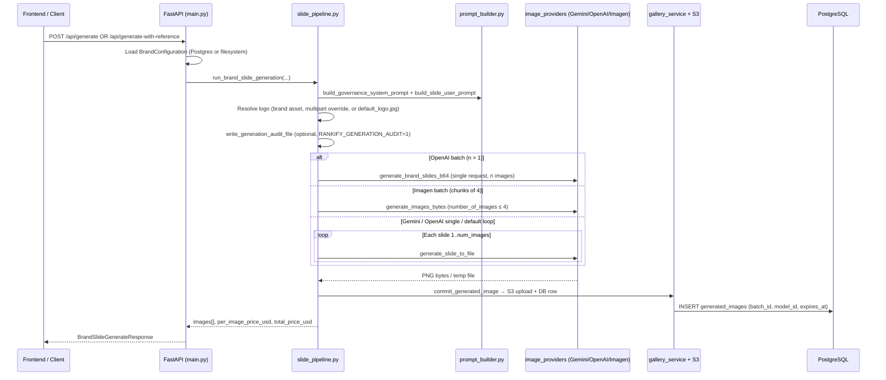
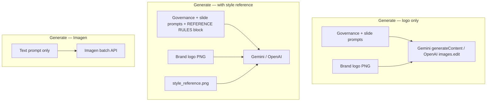
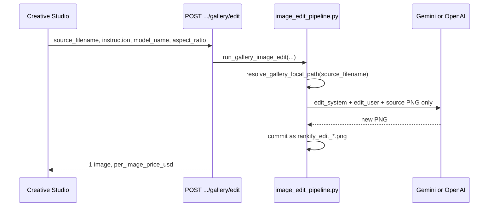
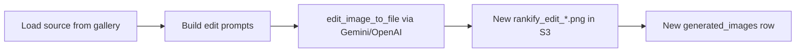

# Rankify — Image Generation Workflow & Cost Analysis

Technical reference for the Rankify Image Automation platform: how images are generated, stored, edited, and what each operation costs.

**Audience:** Engineers, product owners, and finance stakeholders planning usage or budgets.

**Source of truth for pricing hints:** `backend/generation/image_providers/registry.py` (`estimate_price_usd`). These are **static estimates** returned in API responses — not live invoices from Google or OpenAI.

---

## 1. System overview

| Layer | Technology | Role |
|-------|------------|------|
| **Frontend** | React + Vite (`frontend/`) | Creative Studio UI — brands, generate, gallery, edit |
| **API** | FastAPI + Uvicorn (`backend/main.py`) | Auth, brand config, generation orchestration, signed URLs |
| **Image providers** | Google Gemini, Google Imagen 4, OpenAI GPT Image | Cloud inference (billed to your API keys) |
| **Metadata** | PostgreSQL (optional) | Brands, gallery rows, social-copy history |
| **Object storage** | Local disk or AWS S3 (`STORAGE_BACKEND=s3`) | PNG/JPEG rasters + brand logos |

Production setup for this project uses **`DATABASE_URL` + `STORAGE_BACKEND=s3`**: images in S3, metadata in Postgres, presigned `view_url` in gallery responses.

---

## 2. Image generation workflow

### 2.1 End-to-end flow (new slide)



### 2.2 Step-by-step (implementation detail)

1. **Authentication** — Client sends `x-api-key` header matching `API_KEY` in `backend/.env`.

2. **Brand load** — `BrandConfiguration` (governance prompt, colors, typography, voice, logo filename) loaded from Postgres (`brands` table JSONB) or `data/brands/<id>/`.

3. **Prompt assembly** (`generation/prompt_builder.py`)
   - **Governance system prompt** — full brand “bible” from `generation.governance_prompt_template` plus structured visual rules.
   - **Slide user prompt** — structured post copy (title, subtitle, body, CTA) from the request body or `studio_campaign.intent`.

4. **Logo reference**
   - Default: brand logo from S3/local cache (`services/brand_assets.py`).
   - Override: multipart upload on `POST /api/generate-with-logo`.
   - Fallback: `assets/default_logo.jpg`.

5. **Provider dispatch** (`generation/image_providers/runner.py`)
   - Model ID normalized to provider + API model (`registry.normalize_model_id`).
   - **Gemini** — `generateContent` with image modality + logo/reference images.
   - **OpenAI** — Images API (`images.edit` / generation with logo reference); batch `n>1` in one call when provider is OpenAI.
   - **Imagen 4** — `google-genai` batch generate (max 4 images per request); no logo/reference image support for Imagen.

6. **Persistence** (`services/gallery_service.commit_generated_image`)
   - File: `gallery/{brand_id}/rankify_slide_{batch_id}_{index}.png` in S3 (or local `generated-images/<brand_id>/`).
   - DB row: `generated_images` with `batch_id`, `model_id`, `object_key`, `expires_at` (= now + `IMAGE_TTL_HOURS`, default 720 h / 30 days).

7. **Response** — Each image includes presigned S3 URL (or signed local URL), `size_bytes`, `created_at`, and batch-level **`per_image_price_usd`** / **`total_price_usd`**.

### 2.3 Reference images & multimodal inputs (generate vs edit)

Rankify sends **different image attachments** depending on the operation. This is important for cost planning: the API **`estimate_price_usd`** is **per output image**, not per input attachment — but providers may bill multimodal inputs differently on their invoices (not tracked in this repo).

#### 2.3.1 Image input types

| Input type | When used | API / UI | Sent to image model? |
|------------|-----------|----------|----------------------|
| **Brand logo** | Every **new generation** (Gemini & OpenAI) | Resolved from brand assets, or multipart override | **Yes** — always image 1 |
| **Style / layout reference** | Optional **new generation** only | Creative Studio dropzone → `POST /api/generate-with-reference` | **Yes** — image 2 (after logo) on Gemini & OpenAI |
| **Gallery source raster** | **Edit** only | AI edit bar → `POST .../gallery/edit` with `source_filename` | **Yes** — only image (no logo, no style reference) |
| **Gallery image (vision)** | Social copy only | `POST .../text/social-copy` + optional `image_filename` | **gpt-4o-mini** (text model), not image generation |

#### 2.3.2 When the style reference image is used (generation)

**Creative Studio** (`frontend/src/pages/CreativeStudioPage.jsx`):

1. User optionally uploads a **reference image** (layout / mood / composition inspiration).
2. If a reference file is present → **`POST /api/generate-with-reference`** (multipart).
3. If no reference → **`POST /api/generate`** (JSON) — logo only, no style reference.

**Backend** (`slide_pipeline.run_brand_slide_generation`):

- Parameter: `reference_override: Optional[Image.Image]`
- When set:
  - Appends **`build_reference_image_prompt_block()`** to the slide user prompt (`prompt_builder.py`).
  - Passes `style_reference=reference_override` to Gemini or OpenAI providers.
- When **Imagen** is selected **with** a reference → **HTTP 400** (reference not supported).

**Reference prompt rules** (summary):

- Match composition, hierarchy, spacing from the reference.
- Apply **brand** colors and governance — do **not** copy the reference palette if it conflicts.
- Use the user’s post copy for on-image text — do **not** copy text from the reference.
- Do **not** copy third-party logos or watermarks from the reference.

#### 2.3.3 What each provider receives (generation)



| Provider | Logo attached | Style reference attached | API method |
|----------|---------------|--------------------------|------------|
| **Gemini** | Inline image after `LOGO_ATTACHMENT_INSTRUCTION` | Optional 2nd inline image + reference rules text | `generateContent` + `responseModalities: IMAGE` |
| **OpenAI** | `brand_logo.png` in `images.edit` | Optional `style_reference.png` in same edit call | `images.edit` (logo-reference generate pattern) |
| **Imagen 4** | No | **Not supported** (400 if reference uploaded) | Text-only `generate_images` |

**Endpoints for generation with attachments:**

| Endpoint | Logo override | Style reference |
|----------|---------------|-----------------|
| `POST /api/generate` | No (uses brand asset) | No |
| `POST /api/generate-with-logo` | Optional multipart `logo` | No |
| `POST /api/generate-with-reference` | Optional multipart `logo` | Optional multipart `reference_image` |

#### 2.3.4 What happens during gallery edit (no style reference)

**Edit does not use the style reference upload or brand logo as separate attachments.** The model receives:

1. **Edit system prompt** — `EDIT_GOVERNANCE_SYSTEM` (`edit_prompts.py`): preserve layout, typography, logo placement unless the user instruction says otherwise.
2. **Edit user prompt** — user `instruction` + short brand color/name snippet.
3. **One inline image** — the **existing gallery file** (`source_filename`), loaded from S3/local cache.



| Provider | Edit input images | Notes |
|----------|-------------------|-------|
| **Gemini** | Source slide PNG only | `edit_image_to_file` → `generateContent` with edit prompts + inline source |
| **OpenAI** | `source_slide.png` only | `images.edit` with gallery edit prompt |
| **Imagen** | — | **Not supported** for edit (`supports_edit: false` in catalog) |

**UI behavior:**

- **`activeSourceFilename`** — which gallery file is edited (latest variant or user-pinned version).
- Each edit creates a **new** `rankify_edit_*.png`; the original slide remains in the gallery.
- After multiple edits, the API hint recommends editing from the **original slide** in Versions if quality degrades.

**Default edit model in API schema:** `gemini-2.5-flash-image` (fast/cheap); studio may use the same model selected for generation.

#### 2.3.5 Cost impact: reference vs edit

| Operation | Billed units in API response | Reference / extra inputs |
|-----------|------------------------------|---------------------------|
| Generate 1 slide, logo only | `1 × estimate_price_usd(model, size)` | Logo included, no surcharge in code |
| Generate 1 slide, logo + style reference | **Same** `1 × estimate_price_usd` | Reference attached; no separate line item |
| Generate 5 slides with reference | `5 × estimate_price_usd` | Same reference used for the batch (OpenAI/Gemini per call) |
| Gallery edit | `1 × estimate_price_usd` | Source image input; still one output image |
| Regenerate (studio) | `1 × estimate_price_usd` | Re-runs generate path; reference used only if still uploaded in UI |

**Important:** Rankify’s **`total_price_usd`** counts **output images**, not input attachments. If Google or OpenAI charges extra for multimodal tokens, reconcile against provider dashboards — it is **not** reflected in `registry.py` today.

**Examples with reference (same price table as without reference):**

| Scenario | Model | Outputs | Estimated total |
|----------|-------|---------|-----------------|
| 1 slide + style reference image | `gemini-3-pro-image-preview` 2K | 1 | **$0.134** |
| 3 variants + reference | `gemini-3-pro-image-preview` 2K | 3 | **$0.402** |
| 1 edit (“darker background”) | `gemini-2.5-flash-image` | 1 | **$0.039** |
| Generate with reference + 2 edits | Gemini 3 Pro + 2× Flash edit | 3 | **$0.134 + $0.039 + $0.039 = $0.212** |

### 2.4 API entry points

| Endpoint | Method | Use case |
|----------|--------|----------|
| `/api/generate` | POST JSON | Primary studio generate; optional `studio_campaign` |
| `/api/generate-with-logo` | POST multipart | Same pipeline + per-request logo file |
| `/api/generate-with-reference` | POST multipart | Optional **style/layout reference** + optional logo override |
| `/api/brands/{brand_id}/gallery/edit` | POST JSON | Edit existing gallery image — **source raster only** (see §2.3.4) |
| `/api/models` | GET | Model catalog + pricing hints |
| `/api/brands/{brand_id}/gallery` | GET | List gallery with presigned URLs |

### 2.5 Filename conventions

| Pattern | Meaning |
|---------|---------|
| `rankify_slide_{batch_id}_{index}.png` | New generation (`batch_id` = 8-char hex) |
| `rankify_edit_{uuid}.png` | Gallery edit derivative (new file, new DB row) |

---

## 3. Image edit & “recreate” workflow

### 3.1 Gallery edit (refinement)

For **what images are sent to the model during edit** (vs style reference on generate), see **§2.3.4**.

**Endpoint:** `POST /api/brands/{brand_id}/gallery/edit`



1. Validates `source_filename` exists in gallery (DB + S3).
2. Downloads source to temp/cache (`resolve_gallery_local_path`).
3. Builds edit prompts (`generation/edit_prompts.py`) — strict layout preservation policy.
4. Calls **`edit_image_to_file`** with **only the source PNG** — no logo file, no style reference upload (see §2.3.4).
5. Saves **new** file; original is unchanged (version history in UI = multiple gallery rows).

**Cost:** One **`estimate_price_usd(model, image_size)`** per edit — same table as generation (§4).

### 3.2 Recreate vs edit vs regenerate

| Operation | What happens | API cost | Storage |
|-----------|--------------|----------|---------|
| **Edit** | Modify existing raster with instruction | 1× image model price | +1 new S3 object + DB row |
| **Regenerate (new batch)** | Same copy, new `POST /api/generate` or `/generate-with-reference` if reference still uploaded | `num_images` × per-image price | +N new objects |
| **Recreate after TTL purge** | Old S3 object deleted; must generate again | Full generation cost again | New object |
| **Re-run edit chain** | Edit of an edit | 1× price per edit step | +1 object per step |

There is **no “free recreate”** in the codebase: any new pixel output from a provider is a full billed inference call. Storage (S3) is separate and comparatively small (§5).

---

## 4. Cost analysis — image models

### 4.1 Important disclaimers

- Figures below come from **`GEMINI_IMAGE_PRICE_TABLE_USD`**, **`OPENAI_IMAGE_PRICE_TABLE_USD`**, and **`IMAGEN_PRICE_TABLE_USD`** in `registry.py`.
- They are **hints** surfaced in `GET /api/models` and generate/edit responses — **not guaranteed** to match Google Cloud or OpenAI invoices.
- Imagen pricing varies by region/account (noted in code comments).
- **Social copy** uses OpenAI `gpt-4o-mini` — not priced in registry (see §4.4).
- **No markup** — Rankify passes through provider usage; you pay Google/OpenAI/AWS directly.

### 4.2 Cost per generated image (USD)

#### Google Gemini

| Model | 1K | 2K | 4K | Notes |
|-------|-----|-----|-----|-------|
| `gemini-2.5-flash-image` | — | **$0.039** | — | Flat rate; size param ignored |
| `gemini-3-pro-image-preview` | $0.134 | **$0.134** | **$0.24** | Default studio workhorse |

#### OpenAI (client model id: `openai:<name>`)

| Model | 1K | 2K | 4K |
|-------|-----|-----|-----|
| `openai:gpt-image-1-mini` | — | **$0.04** | — |
| `openai:gpt-image-1` | $0.07 | **$0.10** | $0.16 |
| `openai:gpt-image-1.5` | $0.075 | **$0.11** | $0.17 |
| `openai:gpt-image-2` | (uses 2K default in tables) | **$0.12** | — |

*Note: `gpt-image-2` pricing falls back to $0.12 if size not in table.*

#### Google Imagen 4

| Model | 1K | 2K | 4K | Edit support |
|-------|-----|-----|-----|--------------|
| `imagen-4.0-fast-generate-001` | $0.04 | **$0.06** | $0.10 | No |
| `imagen-4.0-generate-001` | $0.06 | **$0.09** | $0.14 | No |
| `imagen-4.0-ultra-generate-001` | $0.10 | **$0.14** | $0.22 | No |

*Imagen uses text prompt only (no logo/reference image in pipeline).*

### 4.3 Total batch cost formula

```
total_price_usd = round(per_image_price_usd × slide_count, 3)
```

Returned in `BrandSlideGenerateResponse` from:
- `POST /api/generate`
- `POST /api/generate-with-logo`
- `POST /api/generate-with-reference`
- `POST /api/brands/{brand_id}/gallery/edit` (always `slide_count = 1`)

**Examples**

| Scenario | Model | Size | Count | Per image | Total |
|----------|-------|------|-------|-----------|-------|
| 1 LinkedIn slide | `gemini-3-pro-image-preview` | 2K | 1 | $0.134 | **$0.134** |
| Carousel 5 slides | `gemini-3-pro-image-preview` | 2K | 5 | $0.134 | **$0.670** |
| 52 images (e.g. N+ brand batch) | `gemini-3-pro-image-preview` | 2K | 52 | $0.134 | **$6.968** |
| 10 slides, budget | `gemini-2.5-flash-image` | — | 10 | $0.039 | **$0.390** |
| 1 edit pass | `openai:gpt-image-2` | 2K | 1 | $0.12 | **$0.120** |
| 3 edit iterations on same concept | `gemini-3-pro-image-preview` | 2K | 3 edits | $0.134 | **$0.402** |

### 4.4 Recreate / recovery costs

| Situation | Generation API cost | Notes |
|-----------|---------------------|-------|
| User clicks Generate again with same copy | Full batch cost | New `batch_id`, new files |
| User edits existing image | 1× edit price | Original file retained |
| Image purged after 30 days (`IMAGE_TTL_HOURS=720`) | Full cost to regenerate | S3 + DB row removed by background job |
| DB metadata lost but S3 files remain | **$0** to re-link metadata | Run `python scripts/recover_gallery_from_s3.py` (no provider call) |
| Must reproduce pixels from scratch (no S3 file) | Full generation cost | Same as new generate |

**Edit chain example:** Start with 1 generated slide ($0.134), then 2 edits ($0.134 each) → **$0.402 total** for three provider calls, **three** gallery files in S3.

### 4.5 Social copy (text, not image)

| Feature | Model | Endpoint | Image cost table |
|---------|-------|----------|------------------|
| Caption + hashtags | `gpt-4o-mini` | `POST .../text/social-copy` | Not in `registry.py` |

Typical OpenAI `gpt-4o-mini` pricing is orders of magnitude below image generation (fractions of a cent per request for short copy). Vision input (optional gallery image) adds modest token cost.

---

## 5. Infrastructure costs (non-AI)

These are **not** calculated in application code but matter for total cost of ownership.

| Component | When | Rough impact |
|-----------|------|--------------|
| **AWS S3** | `STORAGE_BACKEND=s3` | ~$0.023/GB-month storage + PUT/GET requests; ~1–4 MB PNG × image count |
| **S3 egress** | Presigned URL downloads | Often low for studio use; scales with external views |
| **PostgreSQL** | `DATABASE_URL` set | Small metadata rows; negligible vs inference |
| **Gallery TTL purge** | Every ~15 min | Deletes expired S3 objects — controls storage growth |

**Example:** 200 images × 2 MB ≈ 400 MB S3 → **~$0.01/month** storage (us-east-1 order of magnitude). Inference dominates.

---

## 6. Model selection guide (cost vs capability)

| Priority | Suggested model | ~Cost @ 2K | Logo on generate | Style reference on generate | Gallery edit |
|----------|-----------------|------------|------------------|---------------------------|--------------|
| Highest quality / brand fidelity | `gemini-3-pro-image-preview` | $0.134 | Yes | Yes | Yes |
| Volume / experiments | `gemini-2.5-flash-image` | $0.039 | Yes | Yes | Yes (default for edits) |
| OpenAI ecosystem | `openai:gpt-image-1.5` | $0.11 | Yes | Yes | Yes |
| Budget OpenAI | `openai:gpt-image-1-mini` | $0.04 | Yes | Yes | Yes |
| Text-only prompt, no logo | `imagen-4.0-fast-generate-001` | $0.06 | No | **No** | No |

---

## 7. Observability & audit

| Mechanism | Purpose |
|-----------|---------|
| API response fields | `per_image_price_usd`, `total_price_usd`, `model_used` |
| `GET /api/models` | Catalog with `pricing` or `price_per_image_usd` |
| Generation audit files | `RANKIFY_GENERATION_AUDIT=1` → prompt/colors dump under `generated-images/<brand_id>/_audit/` |
| Application logs | `Slide generation finished ... total_usd=...` |

For finance reconciliation, compare API response totals against **Google Cloud Billing** and **OpenAI Usage** dashboards monthly.

---

## 8. Related documentation

| Document | Topic |
|----------|-------|
| [`backend/README.md`](../README.md) | API reference, env vars, run instructions |
| [`backend/docs/PRODUCTION_DB_S3.md`](PRODUCTION_DB_S3.md) | Postgres + S3 persistence modes |
| [`DEPLOYMENT_AND_ONBOARDING.md`](../../DEPLOYMENT_AND_ONBOARDING.md) | Company onboarding, infrastructure |
| [`backend/scripts/start_rankify_postgres.ps1`](../scripts/start_rankify_postgres.ps1) | Local Postgres startup (Docker Desktop required on Windows) |
| [`backend/scripts/recover_gallery_from_s3.py`](../scripts/recover_gallery_from_s3.py) | Rebuild DB gallery metadata from S3 (no AI cost) |

---

## 9. Revision history

| Date | Notes |
|------|-------|
| 2026-07-03 | Initial workflow + cost analysis from codebase `registry.py` and pipelines |
| 2026-07-03 | Added §2.3 reference image (generate) vs source image (edit) multimodal behavior |
